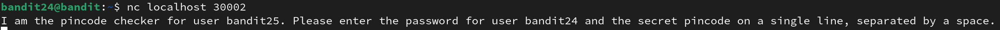
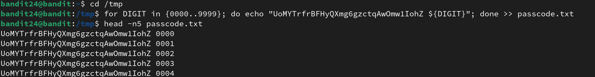
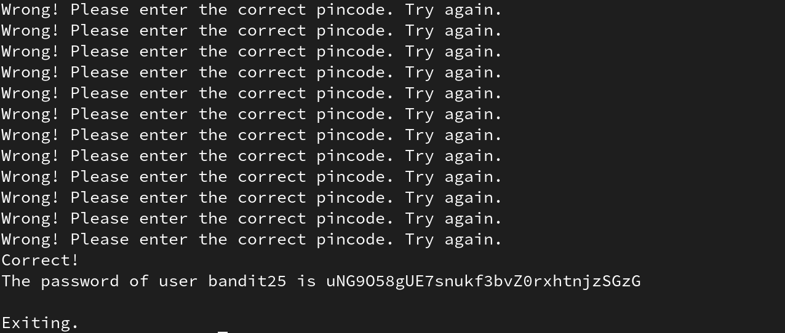

# Bandit level 24 > 25
in this level there is a daemon listening on port 30002 locally.
let's begin researching and hacking our way in.

## SSH
the first thing we do is to connect to this level:
`ssh 176.9.9.172 -p 2220 -l bandit24`
and we give it our password for this level which is `UoMYTrfrBFHyQXmg6gzctqAwOmw1IohZ`.

## Netcat
there is a daemon listetning on port 30002 so it means that we can connect to it using netcat.
and we do that by typing `nc localhost 30002` in terminal, we get a prompt:

now we can either send the password and pincode this way, or pipe `nc` with `echo` and send the password and pincode there:

it seems that we were wrong!

## Generating combinations 
so it begs the question that is it an efficient way of doing this? this way we have to bruteforce it by hand for 9999 times!
but lucikly there is a better way to do this and that's to generate password and pincode from 0000 to 9999 pincode in a file and pipe `nc` with  `cat` command which shows the content of that file, that way `nc` will use every line as its `stdin`.
let's `cd` into the `/tmp` directory and generate it there:

i used `head -n5 passcode.txt` to show that it was succesful, but do note that i only showed the first 5 lines.

## Bruteforcing
now to it's time to bruteforce it:

and it has the result of this:

and we did this, we found the password although we don't know which pincode gave the password to us.

